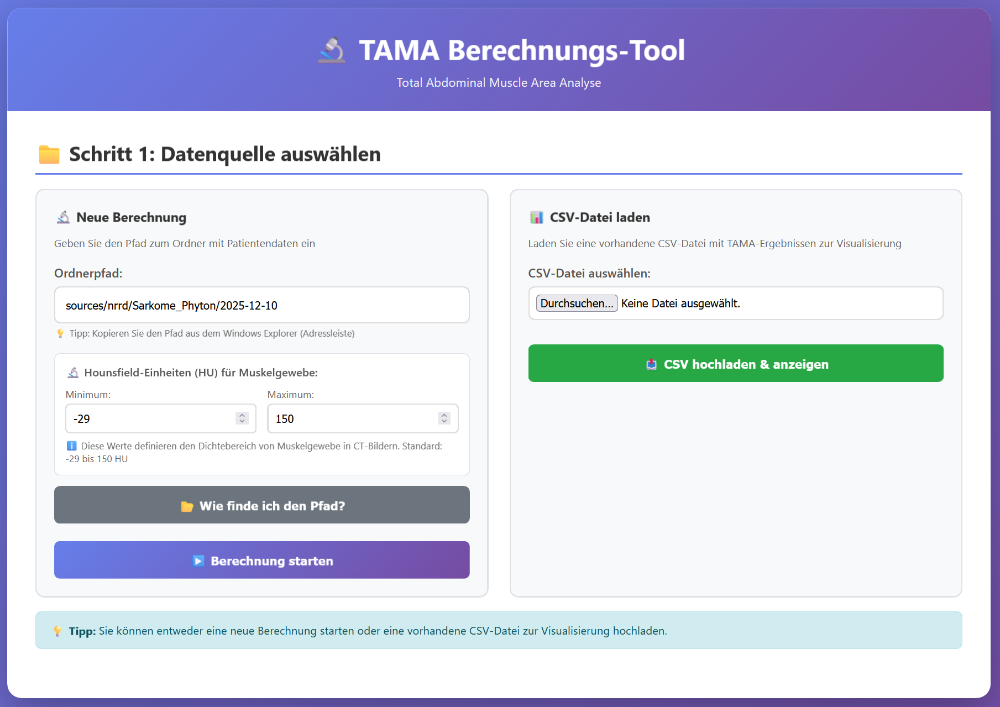
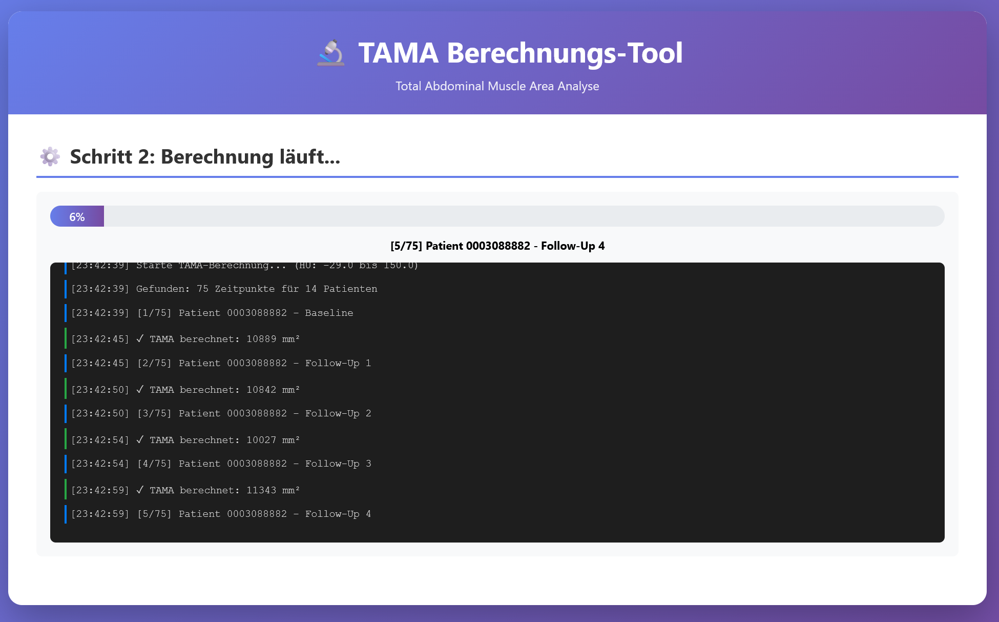
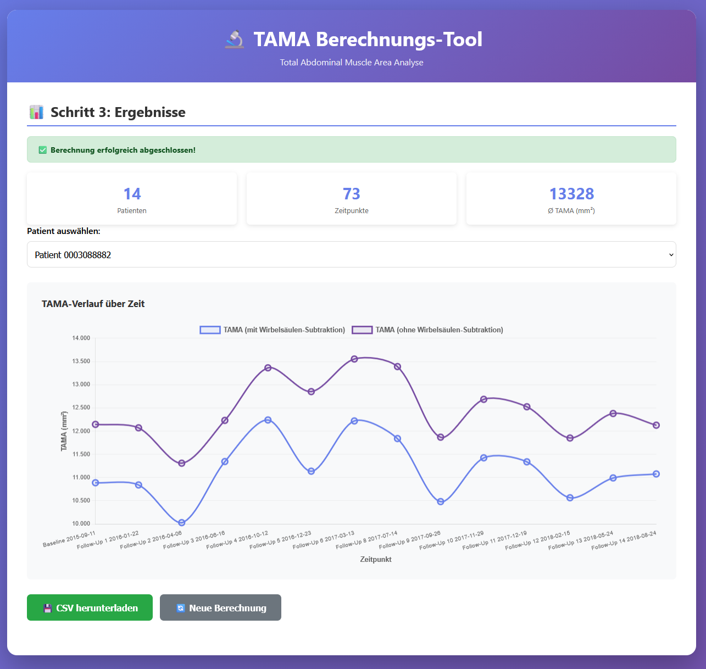

# Cila TAMA Calculator

> Made with good vibes and a healthy dose of vibe coding ✨🎵

A web-based application for calculating **TAMA (Total Abdominal Muscle Area)** from CT scan segmentations. This tool helps track muscle mass changes in patients over time by analyzing medical imaging data.

## What is TAMA?

TAMA represents the total abdominal muscle area, calculated by:
```
TAMA = Total Muscle Segmentation - Visceral Organs
```

The calculation filters muscle tissue based on Hounsfield Unit density values (-29 to 150 HU) to ensure only actual muscle tissue is measured.

## Features

- 🖥️ **User-Friendly Web Interface** - No command line required
- 📊 **Batch Processing** - Analyze multiple patients and timepoints automatically
- 📈 **Real-Time Progress Tracking** - Watch the calculation progress live
- 💾 **CSV Export** - Results saved in an easy-to-analyze format
- 🔄 **Longitudinal Analysis** - Track Baseline and Follow-Up measurements

## How It Works

### 1. Input Selection
Select your patient data folder containing NRRD files with CT scans and segmentations.



### 2. Processing
The application processes each patient's data, calculating TAMA values for all available timepoints.



### 3. Results
View the calculated TAMA areas with patient IDs, timepoints, and dates. Export results to CSV.



## Installation

### Requirements
```bash
pip install -r requirements.txt
```

### Running the Application

**Web Interface:**
```bash
python app.py
```
The application will open automatically in your default browser at `http://localhost:5000`

**Command Line (Batch Mode):**
```bash
python calculate_tama.py
```

## Data Structure

The application expects the following folder structure:
```
sources/nrrd/Sarkome_Phyton/YYYY-MM-DD/
├── PatientID_1/
│   └── Befundverlauf 1/
│       └── 0/
│           ├── Baseline/
│           │   ├── *org*.nrrd (CT scan)
│           │   ├── *Musc*.nrrd (muscle segmentation)
│           │   └── *Visc*.nrrd (visceral organ segmentation)
│           ├── Follow-Up 1/
│           └── Follow-Up 2/
└── PatientID_2/
    └── ...
```

## Output

Results are saved in `tama_areas.csv`:
```csv
patId;timepoint;date;tamaArea
0003088882;Baseline;2024-05-15;12345.67
0003088882;Follow-Up 1;2024-08-20;11987.34
```

## Building Executables

**Windows:**
```bash
build_windows.bat
```

**macOS:**
```bash
./build_macos.sh
```

## Technical Details

- **Framework:** Flask with CORS support
- **Medical Imaging:** SimpleITK for NRRD file processing
- **Frontend:** Vanilla JavaScript with real-time progress updates
- **Processing:** Multi-threaded calculation with progress queue

## Use Cases

- Track muscle mass changes during treatment
- Compare muscle area across patient cohorts
- Evaluate treatment effectiveness
- Monitor sarcopenia progression

---

**Note:** This tool is for research purposes. Always validate results with clinical expertise.
